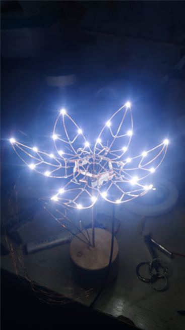
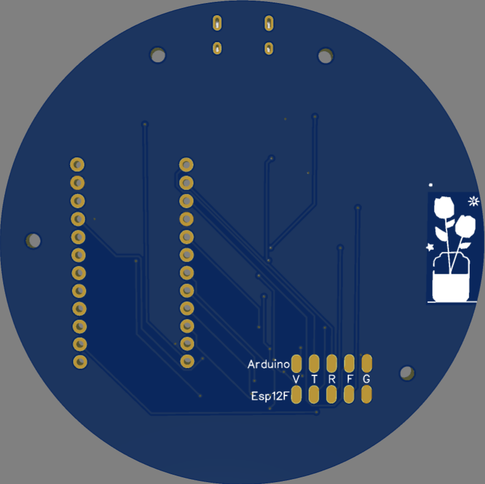

# Tulip
机械郁金香

### 成品展示
 

### 渊源
>&emsp; &emsp; 闲逛B站看到有大佬分享制作的机械郁金香成品，甚是喜欢，恰是恋爱期间，遂决定复刻一版。在实现的过程中，买了很多材料，包括但不限于各种规格的尺寸的铜丝铜杆铜管(个别店铺尺寸不准)、电钻（外加槽刀、铣刀。用于底座开槽）、电烙铁（必备）、锡丝（大量，焊接郁金香框架的消耗厉害）、纸胶带（用于焊接时固定）、支架（焊接时固定）、圆木块（底座）。。。具体材料规格详见原作者。

### 清单
>* Arduino Mini pro 5V，主要是考虑PCB的尺寸
>* ESP12f，负责MQTT透传，随意
>* 舵机SG90，务必买90度
>* 1mm铜丝，用于整体支架
>* 2mm铜管，实际使用建议买稍微大一点，内径至少1mm多
>* 0.1mm漆包线
>* 5050封装WS2812B灯
>* 1206封装白色LED

### PCB底座

### 简要说明
>&emsp;&emsp;程序使用ArduinoIDE开发，通过舵机的旋转及曲杆形成花开花谢的效果。项目难点在于机械部分的制作，您可能需要根据原作者提供的尺寸图来制作花瓣、花蕊、曲柄部分，由于纯手工焊接，很难做到成品外观的完全一致，因此很具有差异性（制做一次不想做第二次）。

### 关键逻辑
>&emsp;&emsp;Arduino主控负责处理TTP223触摸中断、SoftPWM负责调节花瓣灯光亮度、FastLED库负责ws2812b花蕊的效果、SoftwareSerial负责软串口与esp12f通信、esp8266负责联网及MQTT订阅发布。
>&emsp;&emsp;舵机摆放的朝向决定了花开花谢时舵机应该旋转的方向，根据实际情况决定；代码中应该给予一个合适的中间位置用于舵机的初始化，错误的位置初始化对于舵机连接的直杆是致命的。
>&emsp;&emsp;花瓣的制作应该是最大的难点，您需要制作6片尺寸近乎一致的花瓣。由于达不到原作者的条件，实际操作时，先在纸张上画出花瓣的草图，量出花瓣的长，剪出对应长度的铜丝，根据草图编制花瓣。焊接时，需要借助纸胶带和支架的配合，因为铜杆导热性非常好，焊接时需要果断迅速。
>

### 存在问题
>&emsp;&emsp;原作者使用的库函数不存在该问题!
>&emsp;&emsp;成品在实际工作时我们将发现，舵机会不自觉的抖动，实际上是Servo库与彩灯库产生了冲突，可以使用原作者的库函数以解决这个问题。当前项目的源码并未使用原作者的这个库函数。

### 版权
>&emsp;&emsp;原作者Jiří Praus采用了CC BY-NC-SA的版权，核心代码参考原作者，esp部分是为了实现远端控制，控制逻辑稍作修改以适应实际情况，本项目仅做心得分享，制作细节详见如下链接。
>[原作者及源码](https://www.hackster.io/jiripraus/ever-blooming-mechanical-tulip-1b0323)
>[原作者Twitter](https://twitter.com/jipraus)
